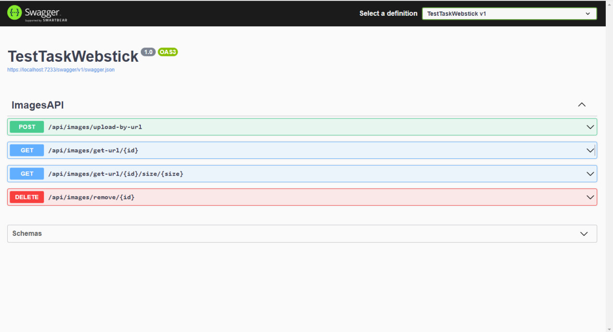
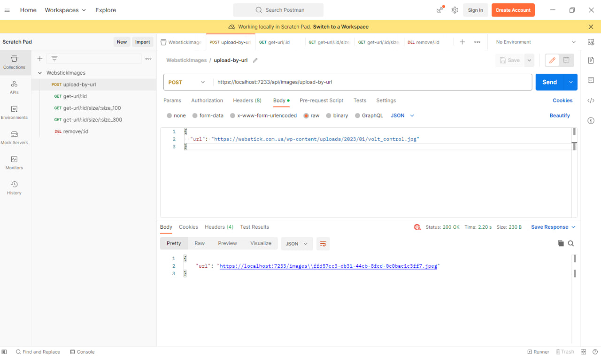
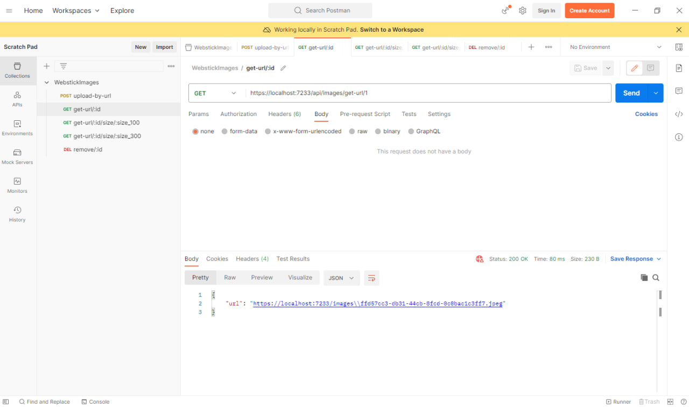
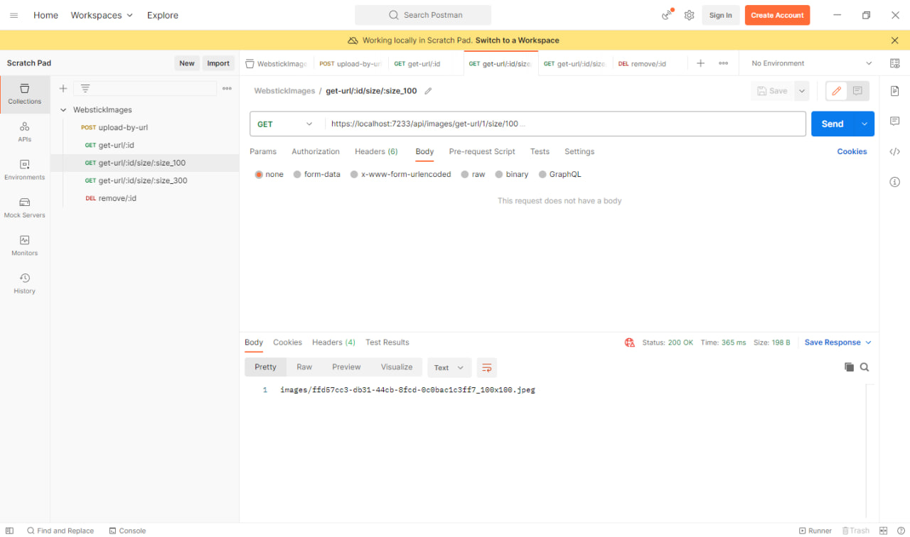
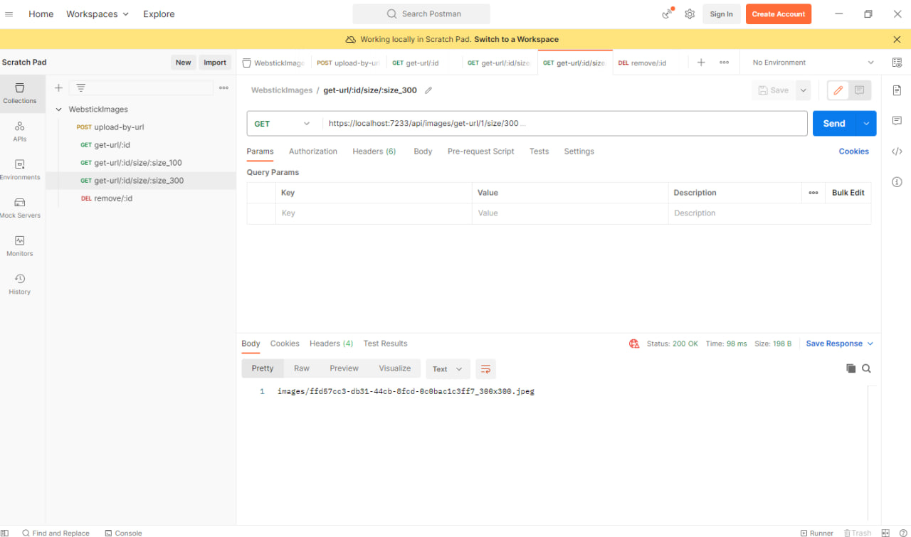
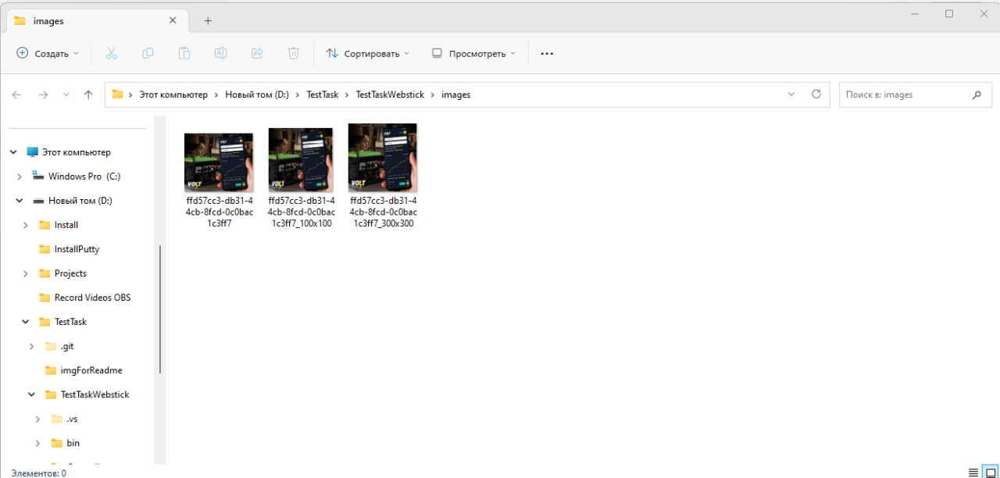
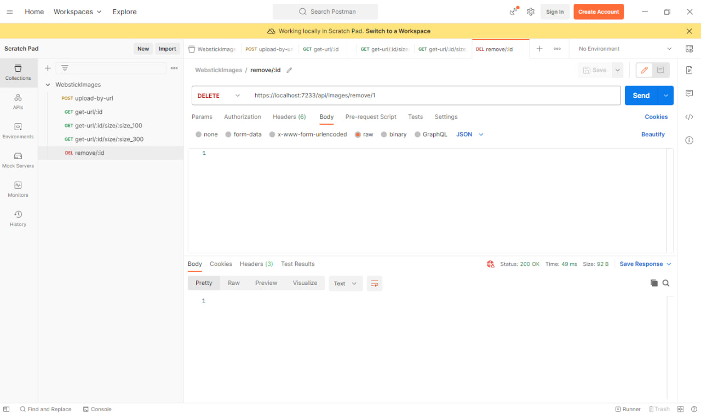
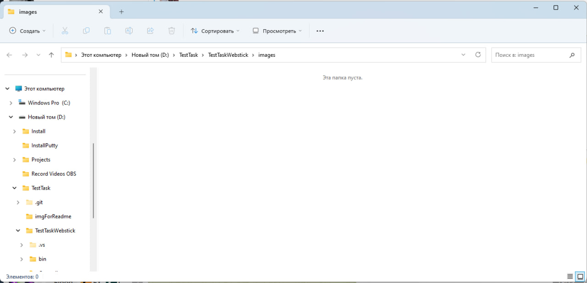
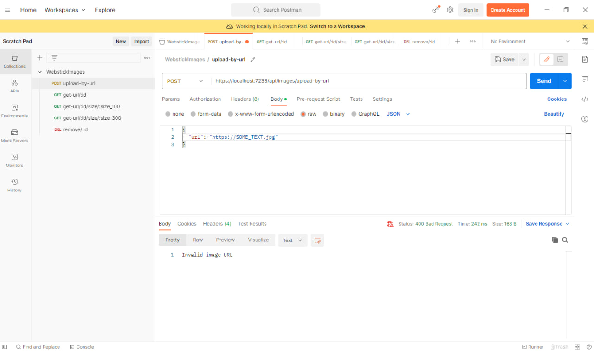

### Постановка задачі

[Посилання на завдання](https://docs.google.com/document/d/1rN5Kpokqya6wTEViC_GvClnq-GOJ5HK7E3BdiTyPi4I/edit#)

### Посилання на репозитарій проєкту
[Посилання](https://github.com/VladMak11/TestTaskWebstickMaksymenko)

### Виконав
Максименко В.О. [Посилання на CV](https://drive.google.com/file/d/1MSJBEHmWgQlJQ49KGeu0O-dzIlnv6jdL/view?usp=share_link)
Зв'язок зі мною у Телеграм [клік](https://t.me/victory1105)

### Коротко про проєкт
> Даний код представляє API-контролер для роботи з зображеннями. Він містить 4 основні ендпоінти, які сформовані в ТЗ та обслуговуючі методи для функціонування основних:
>+ UploadImageByUrl: POST-запит для завантаження зображення за URL. Перевіряє валідність URL та розмір зображення, зберігає зображення на сервері та додає посилання на нього у базу даних.
>+ GetImageUrl: GET-запит для отримання URL зображення за його ідентифікатором. Перевіряє наявність посилання на зображення в базі даних та повертає URL.
>+ GetImageThumnailUrl: GET-запит для отримання URL прев'ю зображення заданого розміру за його ідентифікатором. Перевіряє наявність зображення та прев'ю, і якщо прев'ю відсутнє, створює його та зберігає. За ТЗ підтримує два формати 100 на 100 та 300 на 300
>+ Remove: DELETE-запит для видалення зображення за його ідентифікатором. Перевіряє наявність зображення та видаляє його з усіх місць, де воно було збережене (включаючи прев'ю 100 та 300 формату), а потім видаляє запис з бази даних.

>Контролер використовує екземпляр ApplicationDBContext для взаємодії з базою даних. Клас ImageModel містить властивості для зберігання інформації про зображення. Id є первинним ключем, а Url є обов'язковим полем, яке містить URL зображення. 
>Для додавання контексту бази даних в сервісний контейнер використовується метод AddDbContext. В даному випадку, використовується *ін-меморі* база даних, що зберігається в пам'яті, а не в постійному сховищі(виконаня однієї з основних умов з ТЗ). Налаштування для цього зчитуються з конфігураційного файлу. За допомогою методу UseInMemoryDatabase вказується використання бази даних в пам'яті з заданим ім'ям.

В репозитарії доданий Postman_Collection.json
####Нижче наведені скриншоти, які демонструють робочу спроможність WEB API

Запуск самої програми перед тим, як тестувати в Postman
>

Для тестування використовується картинка з [сайту](https://webstick.com.ua/), [посилання](https://webstick.com.ua/wp-content/uploads/2023/01/volt_control.jpg) на саму картинку.

>/api/images/upload-by-url
>

>/api/images/get-url/:id
>

>/api/images/get-url/:id/size/:size
> Для зручності перевірки було створенно два реквести один на 100 інший 300
>
>

>Скріншот папки у провіднику (збереження на сервері у папці проєкту)після відпрацювання попередніх двох запитів
>

>/api/images/remove/:id та скриншот папки провідника,як доказ видалення
>
>

>Нижче наведено виключення для першого запиту(показано для розуміння, що виключення реалізовані) проаналізувати роботу інших виключень можна після клонування
>

